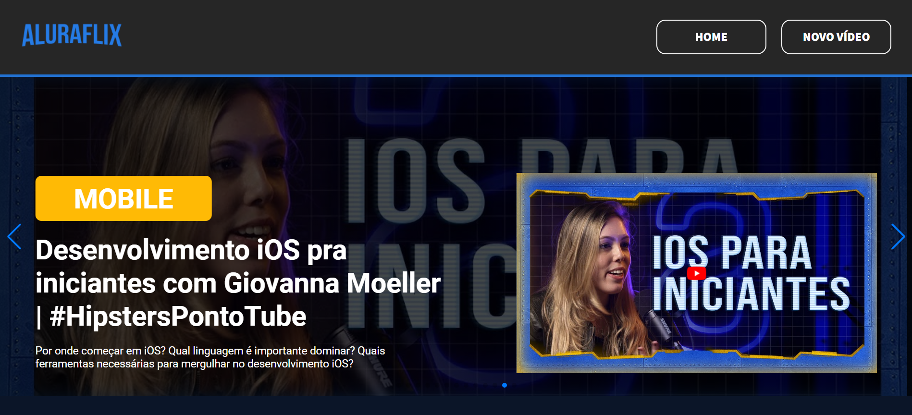

# <h1 align="center"> [AluraFlix](https://alura-flix-delta-eight.vercel.app/) </h1>

  

## Índice

* [1. Introdução](#1-introdução)
* [2. Requisitos](#2-requisitos)
* [3. Ferramentas e mecanismos usados](#3-ferramentas-e-mecanismos-usados)
* [4. Instruções para rodar o projeto](#4-instruções-para-rodar-o-projeto)
* [5. AluraFlix aqui](#5-aluraflix-aqui)
* [6. Projeto desenvolvido por](#6-projeto-desenvolvido-por)

## 1. Introdução

Este projeto foi desenvolvido como parte do curso da Alura, sendo o terceiro e último desafio do programa. O AluraFlix tem como objetivo construir um site em React semelhante à Netflix, porém com vídeos do canal Alura no YouTube. Um dos principais requisitos foi integrar o projeto com o json-server para simular uma API e armazenar dados de forma prática, e assim poder usar os métodos `GET`, `POST` , `PUT` e `DELETE` para gerenciar e atualizar as informações do site de forma dinâmica.

Neste projeto, utilizamos React com Vite e incorporamos diversas funcionalidades, como react-router-dom e os hooks useState, useParams e useEffect, com o objetivo de colocar em prática o conteúdo aprendido durante a formação em React.

#challengeAluraFlix

## 2. Requisitos
[✔] Integração com json-server para Armazenamento de Dados (Simulação de uma API)

[✔] Requisição 'GET' para Leitura de Dados

[✔] Requisição 'POST' para adicionar novos vídeos

[✔] Requisição 'PUT' para editar as informações dos cards dos vídeos

[✔] Requisição 'DELETE' para deletar os vídeos

## 3. Ferramentas e mecanismos usados
— HTML

— CSS

— React

— VSCODE

— Figma

— Git

# 4. Instruções para rodar o projeto

Nosso projeto tinha como desafio implementar um CRUD, para o qual criamos um arquivo db.json para simular uma API. Para executar o projeto localmente, você precisará utilizar o JSON Server como servidor. Abaixo, segue o passo a passo detalhado para você rodar o projeto e testar todas as funcionalidades do CRUD.

#### Passo a Passo para Clonar e Rodar o Projeto com JSON Server
  1. Abra o terminal.

  2. Execute o comando: `git clone https://github.com/CatarinaEudoxia/aluraFlix.git`

  3. Navegue até o diretório do projeto clonado: `cd aluraFlix`

  4. Instale as dependências do projeto (Tenha o Node.js instalado no seu sistema.): `npm install` 

  5. Inicie o JSON Server com o arquivo "db.json": `npm start`

Com o JSON Server rodando, você pode agora testar as funcionalidades do projeto que dependem da API simulada.

#### Certifique-se de estar executando o projeto em um novo terminal no Visual Studio Code usando o comando `npm run dev`.

O comando `npm run dev` executará o projeto, enquanto `npm start` executará seu arquivo JSON.

# 5. AluraFlix aqui:

### Aproveite e de uma olhadinha no projeto [AluraFlix!](https://alura-flix-delta-eight.vercel.app/)

 

  

 

# 6. Projeto desenvolvido por:

  <table>
    <tr>
      <td align="center">
        <a href="#">
           
          
            <b>Catarina Eudoxia Ferreira</b>
          
        </a>
      </td>
    </tr>
  </table>